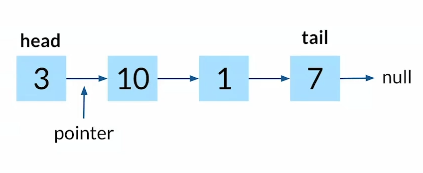
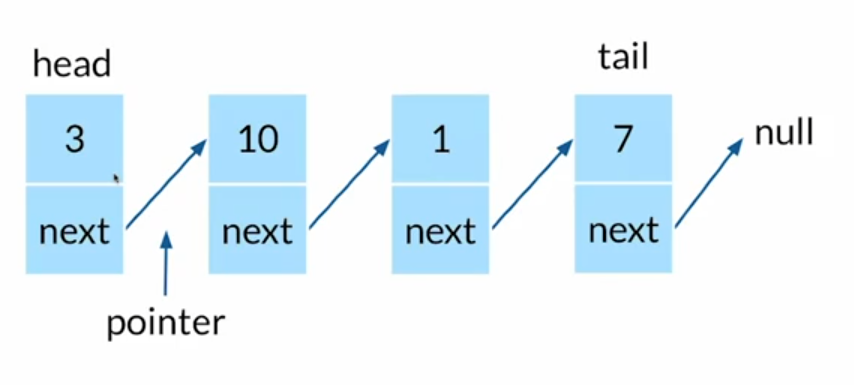

# Linked List

## Anatomía de una linked list

Tenemos un nodo principal que se convierte en el _**head**_, tenemos los nodos centrales y el último que es el _**tail**_; las flechas indican el enlace que liga todos los nodos denominadas pointers.

Existen dos tipos de linked list pero ahora solo vamos a ver solo una.

### Singly linked list

Método | Acción 
---------|----------
 prepend | agrega un nodo al principio
 append | agrega un nodo al final
 lookup / search | busca un nodo
 insert | inserta un nodo en medio de la lista
 delete | borra un nodo

#### Anatomía de una Singly Linked List

Como podemos ver, tenemos el _**head**_ y por debajo de el una variable que contiene el siguiente valor, para obtener un nodo, necesitamos no podemos hacerlo mediante keys, debemos de iterar desde el head y avanzar hasta encontrar el elemento que buscamos. si queremos regresar debemos iterar desde el principio.

## Construyendo una Singly Linked List

### Como se guardan las linked list en memoria

En la imagen vemos los nodos guardados en distintos espacios de memoria no consecutivos, la memoria no conoce las direcciones de los nodos mas que la de el head, Tienen que recorrer todos los nodos para accesar a cualquier nodo que este en medio de head y tail.
