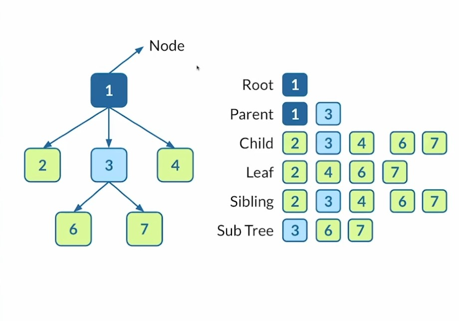
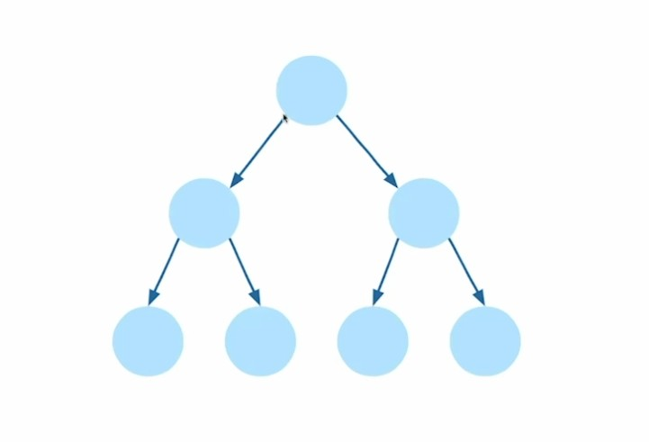
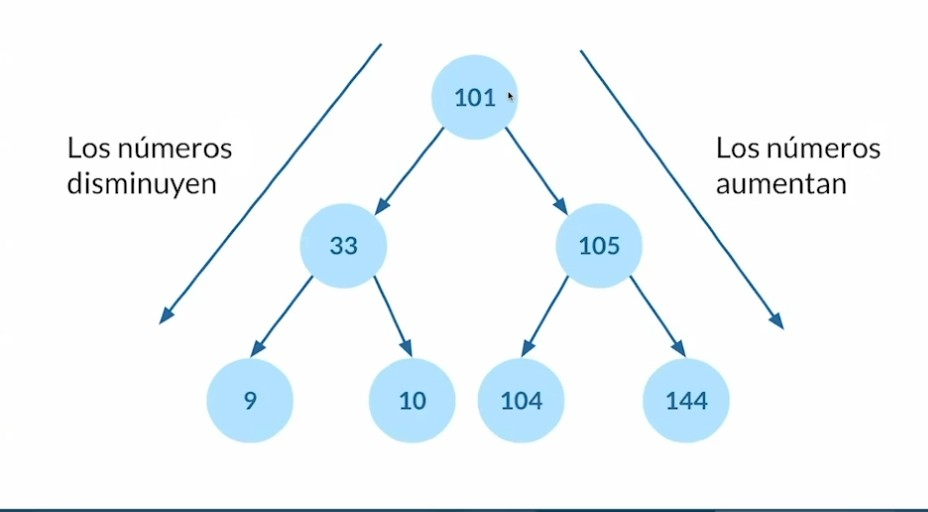
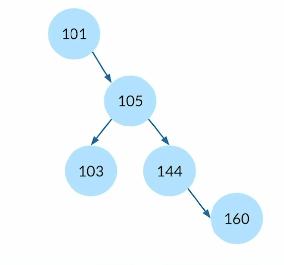

# Trees

## Anatomía de un Tree



### Binary trees (perfect binary tree)



También se le conoce como tree balanceado.

### Binary search trees (balanced tree)



### Unbalanced Tree



**Métodos**:

Método | Acción
:---: | :---:
search | Buscar por un nodo
insert | Insertar un nodo
delete | Borrar un nodo

## Construyendo un Binary search tree

```javascript
class Node {
  constructor(value){
    this.left = null;
    this.rght = null;
    this.value = value;
  }
}

class BinarySearchTree {
  constructor(){
    this.root = null;
  }
  insert(value){
    const newNode = new Node(value);
    if (this.root === null){
      this.root = newNode;
    } else {
      let currentNode =  this.root;
      while(true){
        if(value < currentNode.value){
          if(!currentNode.left){
            currentNode.left = newNode;
            return this;
          }
          currentNode = currentNode.left;
        } else {
          if (!currentNode.right) {
            currentNode.right = newNode;
            return this;
          }
          currentNode = currentNode.right;
        }
      }
    }
  }
}

const tree = new BinarySearchTree();
```