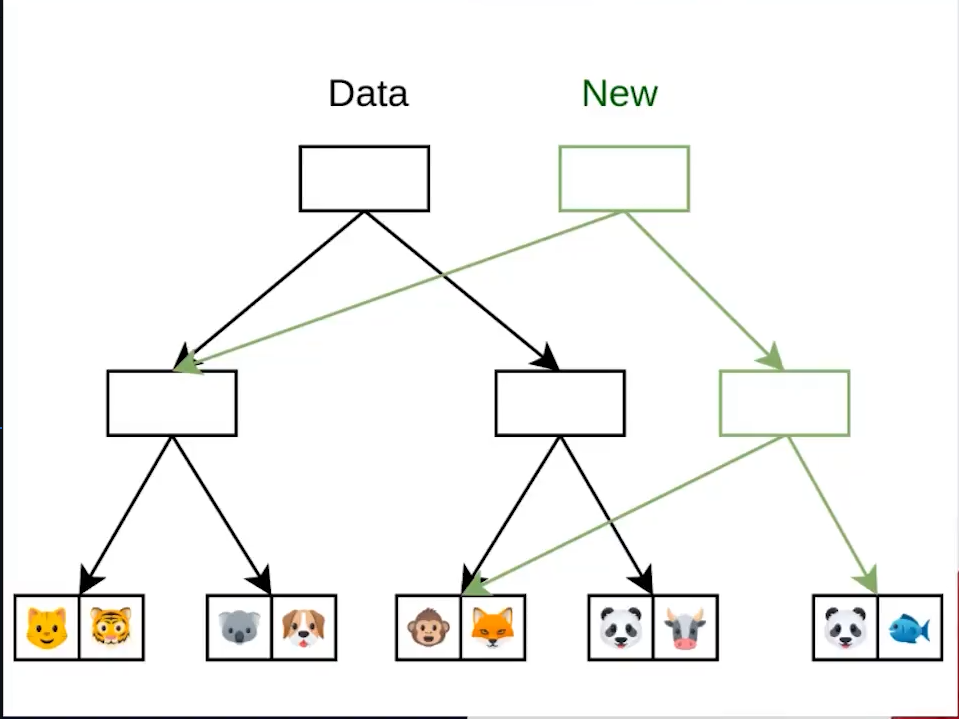

# Fundamentos de manejo de arrays

## forEach

Iteración con forEach
```javascript
const letters = ['a', 'b', 'c']

// solo con for
for (let index = 0; index < letters.length; index++) {
    const element = letters[index];
    console.log('for', element);
}
// output:
// for a
// for b
// for c

// con forEach se reduce significativamente el número de líneas de código.
letters.forEach(item => console.log('forEach', item))
//output:
// forEach a
// forEach b
// forEach c
```

<br>

## Mutabilidad e Inmutabilidad (Transforma, no transforma)
Es la capacidad de un método de array de modificar el array original.
Mayormente se recomienda practicar la Inmutabilidad.

Nos debemos preguntar antes de hacer una modificación...  
...esto traerá efectos colaterales?
```javascript
lovelyPets = [🐵, 🐶, 🦝, 😸];
```
Estructura de datos Inmutable
sin modificar el array original


<br>

## map (Inmutable)
map transforma, 

hace una transformación del array (crea una copia optimizada para trabajar sobre ella) itera y aplica una función para cada uno de los valores.
```javascript
const letters = ['a', 'b', 'c'];

const newArray = letters.map(item => item + '++');
// const newArray = [];
// for (let index = 0; index < letters.length; index++) {
//     const letter = letters[index];
//     newArray.push(letter + '++');
// }

console.log('original', letters);
console.log('new', newArray);
```
```html
<!DOCTYPE html>
<html lang="en">
<head>
    <meta charset="UTF-8">
    <meta name="viewport" content="width=device-width, initial-scale=1.0">
    <title>Document</title>
</head>
<body>
    <script>
        // App 2
        numbers = [1, 2, 3, 4, 5];
        const multipliedNumbers = numbers.map(number => {
            return number * 2;
        });

        console.log(numbers);
        console.log(multipliedNumbers);
    </script>
</body>
</html>
```

<br>

## Map reloaded (Inmutable)
Podemos transformar nuestros arrays en lo que sea. Utilizando esta forma.
Tomares el siguiente array para los ejemplos posteriores:
```javascript
const orders = [
    {
        customerName: 'Nicolas',
        total: 60,
        delivered: true
    },
    {
        customerName: 'Zulema',
        total: 120,
        delivered: false
    },
    {
        customerName: 'Santiago',
        total: 180,
        delivered: true
    },
    {
        cusotmerName: 'Valentina',
        total: 240,
        delivered: true
    }
];
```

<br>

### // Creacion de un array a partir de la información contenida en otro array
```javascript
console.log('original', orders);
const respuesta = orders.map(item => item.total);
console.log('respuesta', respuesta);
```
Output:
```
original [
  { custmerName: 'Nicolas', total: 60, delivered: true },
  { custmerName: 'Zulema', total: 120, delivered: false },
  { custmerName: 'Santiago', total: 180, delivered: true },
  { custmerName: 'Valentina', total: 240, delivered: true }
]
respuesta [ 60, 120, 180, 240 ]
```
```javascript
const respuesta2 = orders.map(item => {
    item.tax = .19;
    return item
})
console.log('respuesta2', respuesta2);
console.log('original', orders)
```
Output:
```
respuesta2 [
  { custmerName: 'Nicolas', total: 60, delivered: true, tax: 0.19 },
  { custmerName: 'Zulema', total: 120, delivered: false, tax: 0.19 },
  { custmerName: 'Santiago', total: 180, delivered: true, tax: 0.19 },
  { custmerName: 'Valentina', total: 240, delivered: true, tax: 0.19 }
]
original [
  { custmerName: 'Nicolas', total: 60, delivered: true, tax: 0.19 },
  { custmerName: 'Zulema', total: 120, delivered: false, tax: 0.19 },
  { custmerName: 'Santiago', total: 180, delivered: true, tax: 0.19 },
  { custmerName: 'Valentina', total: 240, delivered: true, tax: 0.19 }
]
```
Aquí lo que se esta haciendo es trabajar una copia del array de objetos hecha por map, por lo tanto solo sera de manera temporal, ya que el array original no se esta modificando en realidad.

---
### 

```javascript
const respuesta3 = orders.map((item) => {
    return {
        ...item,
        tax: .19
    }
})

console.log('Respuesta #3: ', respuesta3)
console.log('original: ', orders)
```
Output:
```
Respuesta #3:  [
  { customerName: 'Nicolas', total: 60, delivered: true, tax: 0.19 },
  { customerName: 'Zulema', total: 120, delivered: false, tax: 0.19 },
  { customerName: 'Santiago', total: 180, delivered: true, tax: 0.19 },
  { customerName: 'Valentina', total: 240, delivered: true, tax: 0.19 }
]
original:  [
  { customerName: 'Nicolas', total: 60, delivered: true, tax: 0.19 },
  { customerName: 'Zulema', total: 120, delivered: false, tax: 0.19 },
  { customerName: 'Santiago', total: 180, delivered: true, tax: 0.19 },
  { customerName: 'Valentina', total: 240, delivered: true, tax: 0.19 }
]
```

<br>

## Filter (Inmutable)
Ayuda a filtrar los elementos en base a un condicional, los elementos que cumplan con la condición van a ser parte de ese nuevo array
```javascript
const words = [`spray`, s]
```