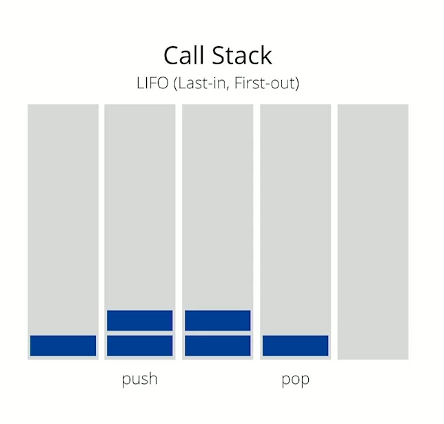
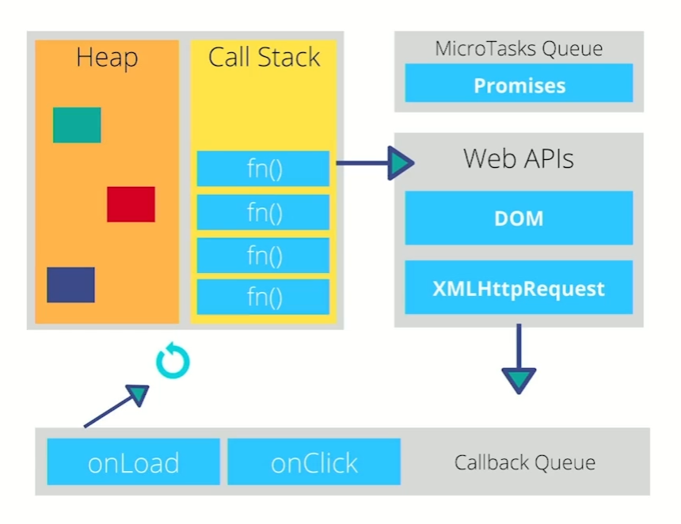

# Introducción

## Lo que aprenderás en este curso

- La importancia del uso del Asincronismo en JS
- Callbacks
- Async y Await
- Promesas

## Que es el asincronismo

Los lenguajes de programación son síncronos, tienen que ejecutarse tarea por tarea.

Se han creado he implementado coneptos, librerias y recursos para agregarle asincronía a la ejecución.

JavaScript es síncrono por defecto y tiene un solo subproceso.

JavaScript es síncrono y no bloqueante, con un bucle de eventos (concurrencia), implementando con un único hilo para para sus interfaces de I/O

### Conceptos

**JavaScript es Single-Threaded**: Aún con múltiples procesadores, solo se puede ejecutar tareas en un solo hilo, llamado el hilo principal.

**Bloqueante**: una tarea no devuelve el control hasta que se ha completado.

**No bloqueante**: Una tarea se devuelve inmediatamente con independencia del resultado. Si se completó, devuelve los datos, si no, un error.

**Síncrono**: Las tareas se ejecutan de forma secuencial, se debe esperar a que se complete para continuar con la siguiente tarea.

**Asíncrono**: Las tareas pueden ser realizadas más tarde, lo que hace posible que una respuesta sea procesada en diferido.

**Concurrencia**: Utiliza un modelo de concurrencia basado en eventos un _"loop de eventos"_ o event loop.

**EventLoop**: Un bucle de eventos es un patrón de diseño que espera y distribuye eventos o mensajes en un programa.

### Formas de manejar la asincronía en JavaScript

Dentro de nuestro lenguaje de programación tenemos los _**Callbacks**_, los cuales son funciones que se pasan como argumento de otra función y que será invocada.

**Promesas**: Funcion no-bloqueante y asíncrona la cual puede retornar un valor ahora, en el futuro o nunca.

**Async y Await**: Permite estructurar una función asincrónica sin bloqueo de una manera similar auna función sincrónica ordinaria.

JavaScript acaba de convertirse en Multi-Threaded con la capacidad de realizar múltiples tareas simultaneas.

**JavaScript**: es asíncrono y no bloqueante, con un bucle de eventos (concurrencia) implementado con un único hilo para sus interfaces de I/O.

## EventLoop

Es un bucle de eventos, un patrón de diseño que espera y distribuye eventos o mensajes en un programa

**Memory heap**: Los objetos son asignados a un montículo (espacio grande en memoria no organizado).

**Call Stack**: Apila de forma organizada las instrucciones de nuestro programa.



**Task Queue**: Cola de tareas, se maneja la concurrencia, se agregan las tareas que ya están listas para pasar al Stack(pila). El stack debe de estar vacío.

**MicroTask Queue**: Las promesas tienen otra forma de ejecutarse y una prioridad superior.

**Web APIs**: JavaScript del lado del cliente: setTimeout, XMLHttpRequest, File Reader, DOM. Node: fs, https.

**EventLoop**: Tarea asignada para mover del Task Queue al Stack, solo si el Stack está vacío.




```javascript
$.on('button', 'click', function onClick(){
  setTimeout(function timer() {
    console.log('You clicked the button')
  }, 2000)
});

console.log("Hi!");

setTimeout(function timeout(){
  console.log("Click the button!");
}, 5000);

console.log("Welcome to the loop");
```